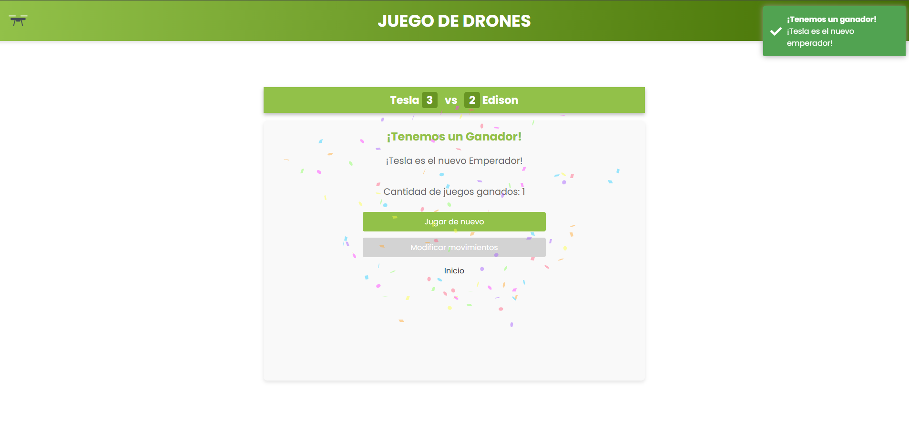
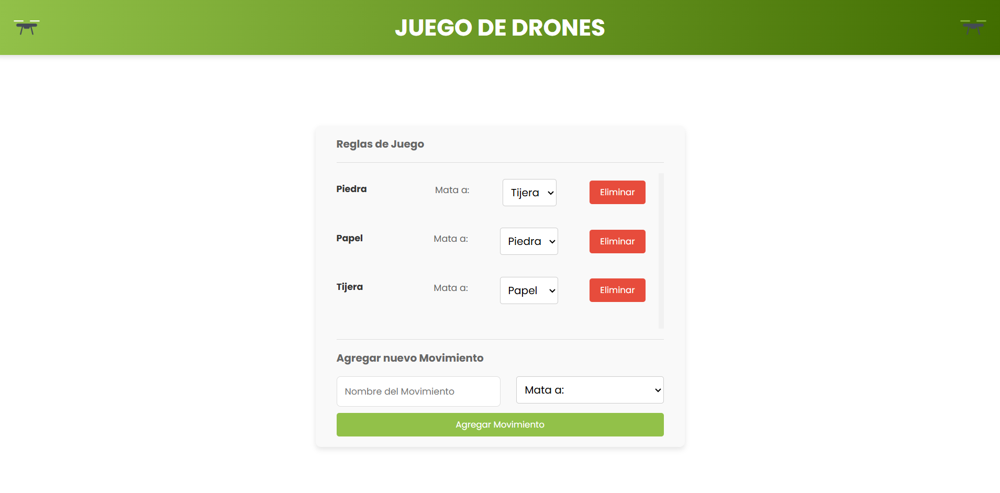

# Game of Drones

Aplicación full stack desarrollada originalmente como parte del proceso de selección que culminó en mi incorporación a MiFinanzas. Posteriormente actualicé el proyecto para reflejar prácticas actuales de desarrollo, seguridad y mantenimiento.

El sistema implementa un juego por turnos para dos jugadores en el que gana quien obtiene tres rondas. Además de las reglas iniciales de piedra, papel o tijera, permite crear movimientos y modificar en tiempo de ejecución qué movimiento vence a cuál.

Este es un proyecto personal de portfolio. No forma parte de los sistemas productivos de MiFinanzas ni constituye una publicación oficial de la empresa.

## Vista previa

### Partida y resultado



### Configuración de movimientos y reglas



## Funcionalidades

- Inicio de partidas entre dos jugadores desde el mismo dispositivo.
- Partidas por rondas hasta que un jugador alcanza tres victorias.
- Persistencia de jugadores, partidas, rondas y resultados.
- Consulta del marcador actual y de las victorias acumuladas por jugador.
- Alta, modificación, eliminación lógica y reactivación de movimientos.
- Configuración en tiempo de ejecución de la relación entre los movimientos.
- API REST documentada mediante Swagger en el entorno de desarrollo.
- Identificación segura de cada partida mediante JWT firmado y validado.

## Tecnologías

### Backend

- .NET 10 y ASP.NET Core.
- Entity Framework Core.
- SQLite.
- JWT Bearer Authentication.
- Serilog.
- Swagger / OpenAPI.

### Frontend

- Angular 22.
- TypeScript 6.
- RxJS.
- SweetAlert2 y Canvas Confetti.
- Vitest para pruebas unitarias.

## Requisitos

- [.NET 10 SDK](https://dotnet.microsoft.com/download/dotnet/10.0).
- [Node.js](https://nodejs.org/) 22.22.3+, 24.15.0+ o 26+, con npm 10 o posterior.

Angular CLI está incluido como dependencia local y no requiere una instalación global.

## Ejecución local

1. Clonar el repositorio:

   ```bash
   git clone https://github.com/Emilio-Machado/Game-of-Drones.git
   cd Game-of-Drones
   ```

2. Ejecutar la aplicación:

   ```bash
   dotnet run
   ```

El proceso de compilación de .NET comprueba la disponibilidad de Node.js y npm, restaura las dependencias con `npm ci` cuando es necesario y genera el frontend Angular antes de iniciar ASP.NET Core. Entity Framework aplica automáticamente las migraciones y crea la base de datos SQLite en el primer inicio.

La aplicación queda disponible en `http://localhost:1179` y Swagger en `http://localhost:1179/swagger` cuando se ejecuta en el entorno de desarrollo.

También puede abrirse la solución en Visual Studio y ejecutarse directamente. `dotnet publish` incluye el frontend Angular compilado en el artefacto resultante.

## Pruebas y validación

Desde `Frontend/Web`, las pruebas unitarias se ejecutan con:

```bash
npm test -- --watch=false
```

La compilación completa del backend y del frontend se valida con:

```bash
dotnet build
```

## Configuración de seguridad

No se necesita configurar un secreto para ejecutar el proyecto localmente. En `Development`, la aplicación genera al iniciar una clave JWT criptográficamente segura y temporal; por ese motivo, los tokens emitidos dejan de ser válidos al reiniciar el backend.

Fuera de `Development`, la aplicación exige:

- `Jwt__Secret`: clave Base64 que decodifique al menos 256 bits.
- `AllowedHosts`: dominios permitidos separados por punto y coma, por ejemplo `app.example.com;api.example.com`.

La autenticación valida la firma, el algoritmo, el emisor, la audiencia y la expiración de los tokens. Las credenciales y claves reales no deben almacenarse en archivos versionados.

## Estructura principal

- `Controllers/`: endpoints de partidas, rondas y movimientos.
- `DTOs/`: contratos utilizados por la API.
- `DataAccess/`: contexto de Entity Framework Core.
- `Models/`: entidades del dominio y de persistencia.
- `Migrations/`: migraciones de la base de datos.
- `Security/`: configuración y generación de JWT.
- `Frontend/Web/`: aplicación Angular.
- `docs/images/`: capturas utilizadas en esta documentación.

## Uso del repositorio

El código se publica como proyecto de portfolio y muestra técnica. Su inclusión en este repositorio no implica respaldo, mantenimiento ni aprobación oficial por parte de MiFinanzas.
